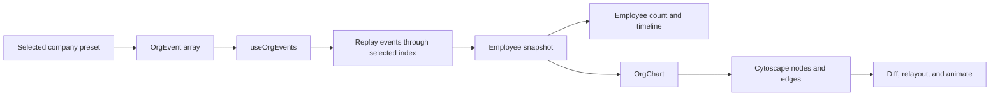

# Crouton Org Chart Demo

Crouton is a frontend-only demonstration of an animated, event-driven organization chart. It replays employee additions, moves, title updates, replacements, and removals, derives the organization at each point in time, and animates the resulting hierarchy with [Cytoscape.js](https://js.cytoscape.org/).

The interface includes timeline playback controls, animated reporting-line changes, pan and zoom, and a live employee count.

## Getting started

This project uses pnpm and requires a current Node.js installation.

```bash
pnpm install
pnpm dev
```

Open [http://localhost:3000](http://localhost:3000).

Useful commands:

```bash
pnpm lint       # Run ESLint
pnpm build      # Create and type-check a production build
pnpm start      # Serve the production build
```

## Event data

The demo does not store finished organization trees. Each company preset has a chronological `OrgEvent[]` in [`app/data/org-events.ts`](app/data/org-events.ts).

Employees use numeric IDs:

```ts
type Employee = {
  id: number;
  name: string;
  role: string;
  reportsTo: number | null;
  directReports: number[];
};
```

Every event has a `type` and top-level `employeeId`. The event stream accepts
five payload shapes:

```ts
type OrgEventBase<Type extends string> = {
  type: Type;
  employeeId: number;
};

type OrgEvent =
  | (OrgEventBase<"add"> & {
      employee: Employee;
    })
  | (OrgEventBase<"move"> & {
      employee: Employee;
    })
  | (OrgEventBase<"update"> & {
      role: string;
    })
  | (OrgEventBase<"replace"> & {
      replacement: Pick<Employee, "id" | "name">;
    })
  | OrgEventBase<"remove">;
```

An addition contains the new employee and the IDs of any existing employees who should begin reporting to them:

```ts
{
  type: "add",
  employeeId: 8,
  employee: {
    id: 8,
    name: "Jordan Lee",
    role: "Director, Product",
    reportsTo: 2,
    directReports: [7],
  },
}
```

A removal only needs the departing employee's ID:

```ts
{ type: "remove", employeeId: 3 }
```

A move uses the same payload as an addition, but its employee ID must already
exist. Updating `reportsTo` moves that employee elsewhere in the hierarchy:

```ts
{
  type: "move",
  employeeId: 8,
  employee: {
    id: 8,
    name: "Jordan Lee",
    role: "VP, Product",
    reportsTo: 1,
    directReports: [7],
  },
}
```

In this example, Jordan becomes VP of Product, moves under employee `1`, and
employee `7` reports to Jordan afterward. Any former Jordan reports omitted from
`employee.directReports` move up to Jordan's previous manager.

For add and move events, the top-level `employeeId` must match
`employee.id`. The shared field lets consumers identify an event's subject
without first narrowing its event-specific payload.

An update contains an existing employee ID and their new title. It does not
change their name, manager, or reports:

```ts
{
  type: "update",
  employeeId: 6,
  role: "Senior Product Engineer",
}
```

A replacement identifies the departing employee and provides only the new
employee's identity:

```ts
{
  type: "replace",
  employeeId: 1,
  replacement: {
    id: 10,
    name: "Elena Rossi",
  },
}
```

This atomically replaces employee `1` with employee `10`. The position's role,
manager, and complete reporting structure stay unchanged.

When a manager is removed, their direct reports are reassigned to the manager they reported to. For example, if employee `5` reports to employee `3`, and employee `3` reports to employee `1`, removing employee `3` changes employee `5` to report to employee `1`.

Events remain an array because their chronological order is significant. The
derived organization is a `Map<number, Employee>`, which provides direct lookup,
insertion, and deletion by employee ID. Each event creates a new Map so prior
timeline snapshots remain immutable and React receives a new value to render.

Each employee stores both their manager in `reportsTo` and their reports in
`directReports`. The reducer keeps both directions synchronized. This duplicates
the relationship, but lets moves and removals look up only the affected
employees rather than scanning the entire organization.

## Company presets

The company dropdown selects between three local `CompanyPreset` objects stored
in a `ReadonlyMap<string, CompanyPreset>` for direct lookup by company ID:

- **Crouton:** the original event history.
- **Example Company A:** a small product and engineering organization.
- **Example Company B:** a wider organization with a manager removal.

Each preset contains a stable selector ID, display name, initial timeline index,
and its event array. Selecting a company pauses playback and resets the timeline
to that preset's initial position.

Employee IDs only need to be unique within a company. `OrgChart` is keyed by the
selected company ID so React creates a fresh Cytoscape instance when companies
change; this prevents matching the same numeric employee ID across two presets.

## Data flow



The flow works as follows:

1. `useOrgEvents` selects the active company's ordered event array.
2. The hook takes every event through the currently selected timeline index.
3. `applyEvent` reduces those events into a new immutable `Map<number, Employee>` snapshot.
4. `OrgChartDemo` uses the snapshot for the employee count and passes it to `OrgChart`.
5. `OrgChart` converts each employee into a Cytoscape node and each reporting relationship into an edge.
6. The chart diffs the desired elements against the live Cytoscape graph, adds and removes only what changed, and runs an animated breadth-first layout.

### Addition behavior

For an `add` event, the reducer:

1. Changes every employee listed in `employee.directReports` to report to the new employee.
2. Appends the new employee to the organization snapshot.
3. Adds the new employee to their manager's `directReports` array.

### Removal behavior

For a `remove` event, the reducer:

1. Finds the departing employee and remembers their manager.
2. Removes the departing employee.
3. Reassigns each of their direct reports to the departing employee's manager.

### Move behavior

For a `move` event, the reducer:

1. Verifies that the employee ID already exists and remembers their old manager.
2. Iterates the employee's stored `directReports` and reassigns omitted former reports to that old manager.
3. Assigns every employee listed in `employee.directReports` to the moved employee.
4. Updates both the old and new managers' `directReports` arrays.
5. Replaces the moved employee's name and title fields.

The moving employee's `directReports` array is therefore the complete report
list after the move, not an incremental list of reports to add.

### Update behavior

For an `update` event, the reducer:

1. Finds the employee identified by `employeeId`.
2. Replaces only that employee's `role` value.
3. Preserves their identity and every reporting relationship.

The updated employee is highlighted for that event. Because the hierarchy is
unchanged, no other node receives the highlight.

### Replace behavior

For a `replace` event, the reducer:

1. Finds the position occupied by `employeeId`.
2. Preserves that position's role and manager while replacing its ID and name.
3. Updates each direct report's `reportsTo` reference to the replacement ID.

The replacement ID must differ from the departing employee's ID and cannot
belong to another employee in the current organization. Title-only changes use
an `update` event instead.

Timeline navigation always rebuilds the snapshot from the event history. This makes moving backward deterministic and avoids maintaining separate inverse events.

## Cytoscape boundary

Application IDs remain numbers throughout the event and employee models. Cytoscape requires string element IDs, so `OrgChart` converts IDs to strings only when creating Cytoscape nodes and edges.

The Cytoscape instance is created once when the chart mounts. Subsequent snapshots are synchronized into that existing instance, preserving node positions long enough to animate between layouts instead of replacing the entire canvas.

## Connecting an API

The local company preset Map is intentionally isolated behind [`useOrgEvents`](app/hooks/use-org-events.ts). To connect a backend, replace `companyPresets` with fetched companies and event histories while preserving the `ReadonlyMap<string, CompanyPreset>` and `OrgEvent[]` contracts.

The presentation components do not need to know whether events came from a local constant, HTTP request, or live subscription:

```text
API or subscription -> selected company -> useOrgEvents -> Map<number, Employee> -> UI and Cytoscape
```

For production data, validate that:

- Employee IDs are unique numbers.
- Every event includes the employee it concerns in `employeeId`.
- Add and move events have matching `employeeId` and `employee.id` values.
- `reportsTo` references an employee added earlier in the stream, or is `null` for the root.
- Every `directReports` ID exists when its addition or move event is applied.
- `reportsTo` and `directReports` describe the same relationships in opposite directions.
- An employee cannot report directly or indirectly to themselves.
- Move events reference an employee present at that point in the timeline.
- Update events reference an employee present at that point in the timeline.
- Replace events reference an employee present at that point in the timeline.
- A replacement ID differs from the departing ID and is otherwise unused.
- Removal events reference an employee present at that point in the timeline.
- Events arrive in chronological order.
- Company IDs are unique and stable.
- Events don't result in orphan nodes and there's always a root node in place

## Project structure

```text
app/
├── data/org-events.ts        Event and employee types plus demo data
├── hooks/use-org-events.ts   Company selection and playback state
├── lib/build-organization.ts Pure event reduction and snapshot replay
├── ui/org-chart.tsx          Cytoscape lifecycle, synchronization, and layout
├── ui/org-chart-demo.tsx     Page interface, count, timeline, and controls
├── globals.css               Global and responsive styling
├── layout.tsx                Document shell and metadata
└── page.tsx                  Home route
```

## Technology

- Next.js 16 App Router
- React 19
- TypeScript
- Cytoscape.js
- Tailwind CSS/PostCSS tooling with project-specific global CSS

## Followups

- Build names map in org-chart-demo dynamically (optimization)
- Cache each step in the org buildup or similar change rather than rebuild with reduce in custom hook (optimization)
- Means of making sure node orders in each row of the graph are preserved from action to action
- Predefined set of certain roles and relationships, such as there'll always be a CEO, CTO, etc.
- The ability to group a number of changes into one state update, such as 3 additions to a team all at once
- Smaller conceptual orgs, so instead of showing a full set of however many people, just show the org name or head of that org
- Zoom in on click, hiding nodes that aren't descendants of the selected node
- Have subtrees collapse if gets too large
- Heat map in the time line, showing hiring spikes
- Add-hoc actions, such as adding or removing employees from the local snapshot but not the actual data
- Control over the interval of each step  in the time line. For example changing it so each step is either the change over a month or a quarter, etc.
